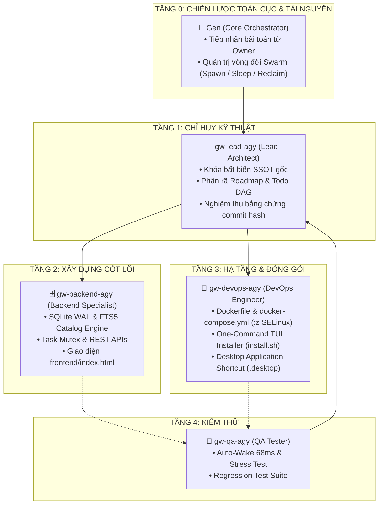

# 🏛️ GEN-WORKPLACE · Multi-Agent Swarm Workplace & Autonomous Mission Control OS
> **Hệ điều hành và trung tâm chỉ huy đa tác nhân (Multi-Agent Swarm Workbench) chuyên biệt cho quy trình phát triển phần mềm tự động hóa cao cấp.**  
> **Chủ sở hữu:** Ryan · **Phiên bản:** v1.2-RELEASE · **Kiến trúc:** SQLite WAL + FTS5 + Docker Sandbox + MCP Server (27 Tools)

[](LICENSE)
[](docker-compose.yml)
[](backend/mcp_core.py)
[](backend/db.py)

---

## 🌟 TỔNG QUAN HỆ THỐNG
**Gen-workplace** cung cấp môi trường tích hợp (Mission Control SPA) giúp Owner quản trị nhiều dự án, tự động phân rã mục tiêu từ Plan & Chat tổng, phân công Role và chỉ định CLI Engine chuyên biệt (`Gemini CLI - agy`, `Claude Code CLI`, `Cursor CLI`), theo dõi tiến trình qua Live Workflow Graph từng node, điều hành qua Swarm Chatroom thuần Việt với @mention/reaction emojis, và quản trị bộ nhớ Single Source of Truth (SSOT).

Đặc biệt, hệ thống tích hợp sẵn **Model Context Protocol (MCP) Server chuẩn quốc tế** với **27 công cụ tự động hóa**, hỗ trợ kết nối 2 chiều cho mọi AI Agent ngoài (Cursor, Claude Desktop, Antigravity, OpenCode).

Tài liệu đặc tả nguồn gốc chính thức: [`docs/SSOT_ORIGINAL_SPEC.md`](docs/SSOT_ORIGINAL_SPEC.md) & [`docs/STANDARD_SQUAD_AND_WORKFLOW.md`](docs/STANDARD_SQUAD_AND_WORKFLOW.md).

---

## 👑 CƠ CẤU ĐỘI NGŨ CHUẨN 5 TẦNG PHÂN LẬP (0-CONFLICT POLICY)



---

## 🚀 CÀI ĐẶT 1 LỆNH (ONE-COMMAND ALL-IN-ONE INSTALLER)

Hỗ trợ tự động trên **Linux**, **macOS** và **Windows (WSL2 / Docker Desktop)**.

### Cách 1: Chạy từ mã nguồn repo
```bash
git clone https://github.com/Genesis-ryan-84-0567536339/gen-workplace.git
cd gen-workplace
./install.sh
```

### Cách 2: Chạy trực tiếp từ GitHub (1 lệnh qua curl)
```bash
curl -fsSL https://raw.githubusercontent.com/Genesis-ryan-84-0567536339/gen-workplace/main/install.sh | bash
```

### ⚡ Các tính năng nổi bật của bộ cài đặt TUI:
- **Giao diện Terminal User Interface (TUI)** chuyên nghiệp, có **thanh loading % tiến độ cài đặt**.
- **Chẩn đoán toàn diện (System Doctor)**: Tự động kiểm tra OS, Git, Curl, Docker Engine và Docker Compose.
- **Môi trường Docker hóa 100%**: Mọi thành phần (Backend, Frontend, Agent Runtimes) chạy an toàn và độc lập trong container Docker với cờ SELinux `:z`.
- **Hỗ trợ Native Standalone Fallback**: Chạy trực tiếp bằng Python nếu máy chủ chưa cài đặt Docker.
- **Tự động tạo Desktop Icon Launcher**: Tự sinh shortcut trên màn hình Desktop (`Gen-workplace.desktop` trên Linux, `.command` trên macOS, `.bat` trên Windows).

---

## 🔌 MODEL CONTEXT PROTOCOL (MCP SERVER & GATEWAY)

Gen-workplace tích hợp sẵn **MCP Server v1.0.0** tuân thủ đặc tả giao thức MCP 2024-11-05, cung cấp **27 công cụ (tools)**, **4 tài nguyên (resources)**, và **2 mẫu chỉ thị (prompts)**.

### Cấu hình kết nối cho AI Agent bên ngoài:

#### 1. Claude Desktop (`claude_desktop_config.json`)
```json
{
  "mcpServers": {
    "gen-workplace": {
      "command": "/usr/local/bin/gen-workplace-mcp"
    }
  }
}
```

#### 2. Cursor IDE (`.cursor/mcp.json`)
```json
{
  "mcpServers": {
    "gen-workplace": {
      "url": "http://localhost:8888/sse?token=YOUR_AGENT_TOKEN"
    }
  }
}
```

#### 3. Bộ 27 MCP Tools Sẵn Sàng:
| Phân hệ | Danh sách Tools |
| :--- | :--- |
| **Quota & Google OAuth** | `get_live_quota`, `list_google_accounts`, `switch_google_account`, `get_oauth_login_url` |
| **Swarm Workers & War Room** | `list_swarm_workers`, `send_worker_directive`, `manage_worker_lifecycle`, `get_worker_terminal_output`, `post_warroom_message`, `get_warroom_messages` |
| **Kanban & Governance** | `list_kanban_tasks`, `create_kanban_task`, `claim_task`, `complete_task`, `update_task_checklist` |
| **Chat & Compaction** | `gen_chat`, `list_conversations`, `create_conversation`, `get_conversation_messages`, `compact_conversation` |
| **Notes & Files** | `list_notes`, `save_note`, `delete_note`, `read_workspace_file`, `create_workspace_file`, `list_workspace_files`, `get_system_status` |

---

## 🏗️ CẤU TRÚC DỰ ÁN
```
gen-workplace/
├── assets/
│   └── icon.svg                     # Biểu tượng nhận diện ứng dụng SVG
├── backend/
│   ├── db.py                        # SQLite 3 WAL Core DB & FTS5 Fast Catalog Engine
│   ├── main.py                      # Control Plane API Daemon & Task Mutex
│   ├── mcp_core.py                  # MCP Protocol Engine & 27 Tools Registry
│   └── mcp_server.py                # MCP Stdio Bridge Process
├── frontend/
│   └── index.html                   # Giao diện SPA chuẩn Nocturne Slate v1.2
├── docs/
│   ├── SSOT_ORIGINAL_SPEC.md        # Nguồn sự thật duy nhất (Mô tả nguyên văn của Owner)
│   ├── STANDARD_SQUAD_AND_WORKFLOW.md # Quy chuẩn đội ngũ và quy trình 5 giai đoạn SOP
│   ├── ARCHITECTURE_STATE.md        # Kiến trúc tổng thể hệ thống
│   └── PROJECT_HANDOFF_SSOT.md      # Tài liệu bàn giao kỹ thuật
├── scripts/
│   └── test_mcp_suite.py            # Bộ kiểm thử tự động 40 test cases (100% PASS)
├── docker-compose.yml               # Cấu hình container đa nền tảng (:z SELinux)
├── Dockerfile                       # Đóng gói image độc lập
├── install.sh                       # Script khởi động 1 lệnh
├── installer_tui.py                 # Bộ cài đặt giao diện TUI có thanh % loading
└── README.md                        # Tài liệu hướng dẫn dự án chuẩn quốc tế
```

---

## 📱 TRUY CẬP ỨNG DỤNG SAU KHI CÀI ĐẶT
- **Trình duyệt máy chủ**: [http://localhost:8888](http://localhost:8888)
- **Truy cập mạng nội bộ**: `http://<IP_MAY_CHU>:8888`
- **Icon Desktop**: Nhấp đúp vào biểu tượng **"Gen-workplace Console"** trên Desktop.
- **Kiểm thử tự động MCP**: `python3 scripts/test_mcp_suite.py`
