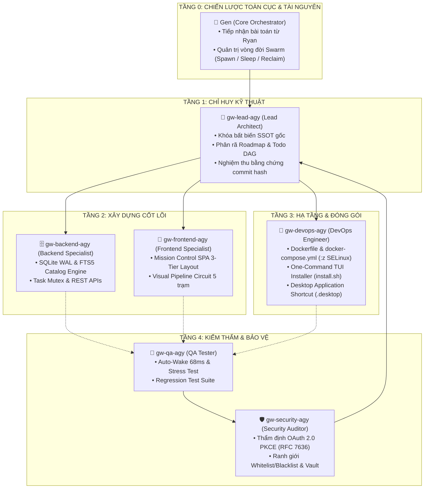

# 🏛️ GEN-WORKPLACE · Multi-Agent Swarm Orchestrator & Autonomous Console
> **Bảng điều khiển và bộ công cụ phân bổ công việc đa tác nhân (Multi-Agent Swarm Workbench) chuyên biệt cho quy trình phát triển phần mềm tự động hóa cao cấp.**  
> **Chủ sở hữu (Owner & SSOT):** Ryan · **Phiên bản:** v1.2-PRODUCTION · **Kiến trúc:** SQLite WAL + Docker Container Sandbox

---

## 🌟 TỔNG QUAN HỆ THỐNG
**Gen-workplace** cung cấp môi trường tích hợp (Mission Control SPA) giúp Owner quản trị nhiều dự án, tự động phân rã mục tiêu từ Plan & Chat tổng, phân công Role và chỉ định CLI Engine chuyên biệt (`Gemini CLI - agy`, `Claude Code CLI`, `Cursor CLI`, `Codex Security CLI`), theo dõi tiến trình qua Live Workflow Graph từng node, điều hành qua Swarm Chatroom thuần Việt với @mention/reaction emojis, và quản trị bộ nhớ Single Source of Truth (SSOT).

Tài liệu đặc tả nguồn gốc chính thức: [`docs/SSOT_ORIGINAL_SPEC.md`](docs/SSOT_ORIGINAL_SPEC.md) & [`docs/STANDARD_SQUAD_AND_WORKFLOW.md`](docs/STANDARD_SQUAD_AND_WORKFLOW.md).

---

## 👑 CƠ CẤU ĐỘI NGŨ CHUẨN 5 TẦNG PHÂN LẬP (0-CONFLICT POLICY)



---

## 💎 CÁC ĐIỂM SÁNG KIẾN TRÚC ĐỘC BẢN

### 1. Khu Implementation 3 Hàng Chuẩn SSOT Của Ryan
- **Hàng 01 (1 hàng 3 cột cân xứng)**:
  - *Cột 1*: **Input & File Plan Gốc**: Điểm nạp chỉ thị duy nhất dùng để chỉ đạo và đồng bộ toàn bộ Role.
  - *Cột 2*: **Lộ Trình Roadmap (5 Phase)**: Phân rã mục tiêu tuần tự.
  - *Cột 3*: **Todo DAG Tasks**: Danh sách nhiệm vụ chi tiết kèm chuỗi phụ thuộc (`depends_on`).
- **Hàng 02**: **Bảng Agent Roles & CLI Engine Selector** (toàn chiều rộng): Lựa chọn CLI Engine cho từng vai trò chuyên môn, khóa Instruction SSOT theo Input tổng.
- **Hàng 03**: **Sơ Đồ Live Workflow Từng Node** (toàn chiều rộng Canvas): Trực quan hóa step-by-step với Checklist INPUT bắt buộc, Checklist OUTPUT nghiệm thu và Checkpoint bàn giao.

### 2. Sơ Đồ Mạch Tư Duy Trực Quan (Visual Pipeline Circuit)
- **Tầng trên**: 5 Node trạm mốc phát sáng nối tiếp bằng luồng dữ liệu neon (`🎯 Mục tiêu` ➔ `🔍 Rà soát DAG` ➔ `⚙️ Lập kế hoạch & Tool` ➔ `🛡️ Kiểm thẩm an ninh` ➔ `🏁 Nghiệm thu`).
- **Tầng dưới**: Bàn làm việc sâu chiếm trọn bề ngang (~1.000px), đọc suy nghĩ nội tâm (CoT), lệnh terminal tool call và chứng thực an ninh.

### 3. Phòng Giao Ban Swarm (War Room) Thuần Việt
- Kênh giao ban chỉ huy thời gian thực: Ryan ↔ Core Gen ↔ Lead Architect ↔ Nhân viên.
- Giao việc qua `@mention`, phản hồi theo thread và cập nhật trạng thái bằng hệ emoji chuẩn nghiệp vụ (`📥 Đã nhận`, `⚠️ Cảnh báo`, `❌ Fail/Lỗi`, `✅ Nghiệm thu`, `❓ Cần làm rõ`).

### 4. Cơ Chế Bộ Nhớ Hai Cột & Tra Cứu Catalog Siêu Tốc (SQLite FTS5)
- *Cột 1*: Memory Tổng (SSOT Bất Biến) do Lead tổng hợp từ các sự kiện đã kiểm chứng.
- *Cột 2*: Memory Từng Role đồng bộ live từ các CLI runtime.
- *Catalog FTS5*: Tra cứu ID siêu tốc (`EVT-`, `VLT-`, `TOOL-`, `FILE-`, `DB-`, `CRD-`) mất < 2ms, tiết kiệm 95% token so với việc quét toàn bộ repository.

---

## 🚀 CÀI ĐẶT 1 LỆNH (ONE-COMMAND ALL-IN-ONE INSTALLER)

Hỗ trợ tự động trên **Linux**, **macOS** và **Windows (WSL2 / Docker Desktop)**.

### Cách 1: Chạy từ mã nguồn repo
```bash
cd /workspace/LinuxDataA/gen-workplace
./install.sh
```

### Cách 2: Chạy trực tiếp từ GitHub (1 lệnh qua curl)
```bash
curl -fsSL https://raw.githubusercontent.com/<OWNER>/gen-workplace/main/install.sh | bash
```

### ⚡ Các tính năng nổi bật của bộ cài đặt TUI:
- **Giao diện Terminal User Interface (TUI)** chuyên nghiệp, có **thanh loading % tiến độ cài đặt**.
- **Tự động Pre-flight Check môi trường**: Kiểm tra OS, Git, Curl, Docker Engine và Docker Compose. Nếu thiếu thành phần nào, kịch bản tự động tải và cấu hình bổ sung.
- **Môi trường Docker hóa 100%**: Mọi thành phần (Backend, Frontend, Agent Runtimes) chạy an toàn và độc lập trong container Docker với cờ SELinux `:z`.
- **Tự động tạo Desktop Icon Launcher**: Tự sinh shortcut trên màn hình Desktop (`Gen-workplace.desktop` trên Linux, `.command` trên macOS, `.bat` trên Windows) để Owner nhấp đúp là gọi ra WebApp ngay lập tức.

---

## 🏗️ CẤU TRÚC DỰ ÁN
```
gen-workplace/
├── assets/
│   └── icon.svg                     # Biểu tượng nhận diện ứng dụng SVG
├── backend/
│   ├── db.py                        # SQLite 3 WAL Core DB & FTS5 Fast Catalog Engine
│   └── main.py                      # Control Plane API Daemon & Task Mutex
├── frontend/
│   └── index.html                   # Giao diện SPA chuẩn Nocturne Slate v1.2
├── docs/
│   ├── SSOT_ORIGINAL_SPEC.md        # Nguồn sự thật duy nhất (Mô tả nguyên văn của Owner)
│   └── STANDARD_SQUAD_AND_WORKFLOW.md # Quy chuẩn đội ngũ và quy trình 5 giai đoạn SOP
├── docker-compose.yml               # Cấu hình container đa nền tảng (:z SELinux)
├── Dockerfile                       # Đóng gói image độc lập
├── install.sh                       # Script khởi động 1 lệnh
├── installer_tui.py                 # Bộ cài đặt giao diện TUI có thanh % loading
└── README.md                        # Tài liệu hướng dẫn dự án chuẩn quốc tế
```

---

## 📱 TRUY CẬP ỨNG DỤNG SAU KHI CÀI ĐẶT
- **Trình duyệt máy chủ**: [http://localhost:8888](http://localhost:8888)
- **Truy cập mạng nội bộ**: `http://<IP_MAY_CHU>:8888`
- **Icon Desktop**: Nhấp đúp vào biểu tượng **"Gen-workplace Console"** trên Desktop.
