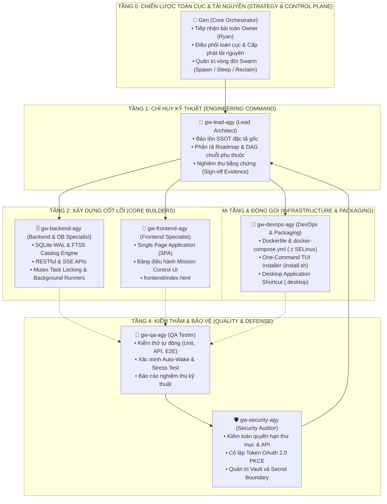

# 🏛️ ĐẶC TẢ ĐỘI NGŨ CHUẨN & QUY TRÌNH CÔNG VIỆC SWARM (STANDARD SQUAD & WORKFLOW CHARTER)
**Dự án**: Gen-workplace (Genesis Workplace AI)  
**Cơ quan ban hành**: Core Orchestrator (Gen) & Lead Architect  
**Cấp thẩm quyền phê duyệt**: Owner (Ryan)  
**Tiêu chuẩn áp dụng**: Genesis Brain Bootstrap (`Genesis-ryan-84-0567536339/Brain/BOOTSTRAP.md`) & Zero-Conflict Policy  
**Trạng thái**: KHÓA BẤT BIẾN (SSOT ENFORCED)

---

## I. CƠ CẤU ĐỘI NGŨ CHUẨN (STANDARD SWARM SQUAD ARCHITECTURE)

Hệ thống Swarm của Gen-workplace được tổ chức theo mô hình **Tháp Chỉ Huy 5 Tầng Phân Lập (Hierarchical 5-Tier Division of Labor)**. Tuyệt đối không để xảy ra tình trạng các AI Agent hoạt động hỗn loạn hoặc tự ý can thiệp chéo lĩnh vực của nhau.

---

## II. HỒ SƠ 6 CHUYÊN GIA & RANH GIỚI THƯ MỤC CỨNG (0-CONFLICT POLICY)

| Mã Định Danh | Tên Chuyên Môn | Vai Trò & Trách Nhiệm Cốt Lõi | 🛡️ Ranh Giới Whitelist (Được Sửa) | ⛔ Ranh Giới Blacklist (CẤM SỬA) | Tài Khoản / Profile OAuth |
| :--- | :--- | :--- | :--- | :--- | :--- |
| **`gw-lead-agy`** | **Lead Architect** | Chỉ huy kiến trúc, duy trì SSOT, thiết kế DAG phụ thuộc, kiểm duyệt bằng chứng và nghiệm thu sản phẩm. | `docs/**`, `workspace/roles/**`, `AGENTS.md`, `README.md`, `ROADMAP.md` | *(Toàn quyền đọc/thẩm định, cấm commit đè code module)* | Mặc định Owner (`owner@genesis.local`) |
| **`gw-backend-agy`** | **Backend & DB Specialist** | Thiết kế CSDL SQLite WAL, FTS5 catalog, các endpoint API nghiệp vụ, cơ chế task mutex và process runner. | `backend/**`, `data/**`, `migrations/**` | `frontend/**`, `Dockerfile`, `docker-compose.yml` | Profile #1 (`owner@genesis.local`) |
| **`gw-frontend-agy`** | **Frontend Specialist** | Xây dựng Web UI (`frontend/index.html`), tương tác thời gian thực, Command Deck, thẻ chuyên gia và dashboard. | `frontend/**`, `assets/**` | `backend/**`, `data/**`, `Dockerfile` | Profile #2 (`claude.bot@genesis.local`) |
| **`gw-devops-agy`** | **DevOps & Packaging** | Container hóa hệ thống, cấu hình volume live-mount SELinux `:z`, kịch bản cài đặt TUI và desktop shortcut. | `Dockerfile`, `docker-compose.yml`, `install.sh`, `installer_tui.py`, `*.desktop`, `scripts/**` | `backend/main.py`, `frontend/**` | Profile #3 (`shared.bot@genesis.local`) |
| **`gw-qa-agy`** | **QA Tester** | Kiểm thử tự động bằng `scripts/test_*.py` (không cần agy/tmux), API regression test, đối soát tiêu chuẩn nghiệm thu của Roadmap. | `tests/**`, `qa_reports/**`, `fixtures/**` | `backend/**`, `frontend/**`, `Dockerfile` | Profile #4 (`shared.bot@genesis.local`) |
| **`gw-security-agy`** | **Security Auditor** | Kiểm toán mã nguồn, bảo vệ bí mật OAuth/API key, phân quyền file, kiểm tra an toàn SELinux và Vault. | `vault/**`, `security_audits/**`, `.env.example` | `backend/**`, `frontend/**` | Mặc định Owner (`owner@genesis.local`) |

---

## III. MA TRẬN TRÁCH NHIỆM RACI (RACI ACCOUNTABILITY MATRIX)

- **R (Responsible)**: Trực tiếp thực thi công việc.
- **A (Accountable)**: Chịu trách nhiệm cuối cùng và ký duyệt nghiệm thu.
- **C (Consulted)**: Được tham vấn chuyên môn, phối hợp kỹ thuật.
- **I (Informed)**: Được thông báo trạng thái tiến độ.

| Nhiệm Vụ Trọng Tâm | Core Gen | Lead | Backend | Frontend | DevOps | QA | Security |
| :--- | :---: | :---: | :---: | :---: | :---: | :---: | :---: |
| **1. Tiếp nhận đề bài & Khóa SSOT gốc** | **A** | **R** | I | I | I | I | C |
| **2. Phân rã Roadmap & Khóa Chuỗi Todo DAG** | **A** | **R** | C | C | C | I | I |
| **3. Thiết kế CSDL SQLite WAL & FTS5** | I | A | **R** | C | I | C | C |
| **4. Xây dựng API Control Plane & Task Mutex** | I | A | **R** | C | I | C | C |
| **5. Phát triển Giao diện Mission Control SPA** | I | A | C | **R** | I | C | I |
| **6. Đóng gói Docker & Cấu hình Live Mount :z** | I | A | C | C | **R** | C | C |
| **7. Viết Kịch bản TUI Installer & Desktop Icon** | I | A | C | I | **R** | C | I |
| **8. Kiểm thử Tự Động & Thẩm Định Hồi Quy** | I | A | C | C | C | **R** | C |
| **9. Kiểm toán Bảo Mật & Cô Lập Token OAuth** | I | A | C | C | C | C | **R** |
| **10. Nghiệm thu Hoàn Tất (Evidence Sign-off)** | C | **A** | R (nộp) | R (nộp) | R (nộp) | C | C |
| **11. Xuất xưởng Release & Báo Cáo Cho Owner** | **R/A** | C | I | I | C | I | I |

---

## IV. QUY TRÌNH CÔNG VIỆC CHUẨN 5 GIAI ĐOẠN (5-STAGE EXECUTION SOP)

Quy trình vận hành từ khi Owner giao nhiệm vụ đến khi xuất xưởng được thực thi nghiêm ngặt theo 5 bước tuần tự:

```mermaid
sequenceDiagram
    autonumber
    actor Owner as 👤 Ryan (Owner)
    participant Gen as 👑 Core Orchestrator (Gen)
    participant Lead as 👑 Lead Architect
    participant Builders as 🗄️ Backend / 🎨 Frontend / 🚢 DevOps
    participant Verifiers as 🧪 QA / 🛡️ Security

    %% Stage 1
    rect rgb(20, 25, 35)
    Note over Owner, Lead: GIAI ĐOẠN 1: TIẾP NHẬN & KHÓA BẤT BIẾN SSOT
    Owner->>Gen: Đưa ra yêu cầu / tính năng mới
    Gen->>Lead: Handoff nguyên văn yêu cầu
    Lead->>Lead: Ghi docs/SSOT_ORIGINAL_SPEC.md & SQLite master_ssot
    Lead-->>Gen: Xác nhận SSOT đã khóa (Zero-Drift)
    end

    %% Stage 2
    rect rgb(25, 30, 42)
    Note over Lead, Builders: GIAI ĐOẠN 2: PHÂN RÃ KIẾN TRÚC & KÝ KẾT HỢP ĐỒNG I/O
    Lead->>Lead: Phân rã Roadmap (RM-01..RM-05) & Todo list (depends_on)
    Lead->>Builders: Thiết lập Live Workflow DAG & Input/Output Contracts
    Builders-->>Lead: Ký kết hợp đồng giao diện kỹ thuật
    end

    %% Stage 3
    rect rgb(20, 32, 28)
    Note over Builders, Verifiers: GIAI ĐOẠN 3: THỰC THI ĐỘC QUYỀN SONG SONG (0-CONFLICT)
    Builders->>Gen: POST /api/task/claim (Khóa Mutex độc quyền)
    Note over Builders: Thực thi code strictly trong Allowed Paths
    Builders->>Builders: Trao đổi I/O Contract qua hệ thống tin nhắn nội bộ
    end

    %% Stage 4
    rect rgb(35, 28, 20)
    Note over Builders, Lead: GIAI ĐOẠN 4: KIỂM THẨM 2 LỚP & NGHIỆM THU BẰNG CHỨNG
    Builders->>Verifiers: Bàn giao artifact / commit cho QA & Security
    Verifiers->>Verifiers: Chạy Test Suite, quét lỗ hổng token & quyền hạn
    Verifiers-->>Builders: Chứng thư kiểm định (Pass 100%)
    Builders->>Gen: POST /api/task/complete (Nộp kèm Evidence/Commit Hash)
    Lead->>Lead: Kiểm chứng bằng chứng & Ký duyệt verified_by
    end

    %% Stage 5
    rect rgb(24, 20, 35)
    Note over Gen, Owner: GIAI ĐOẠN 5: ĐÓNG GÓI, NGỦ ĐÔNG TIẾT KIỆM & BÁO CÁO OWNER
    Gen->>Builders: Kích hoạt ngủ đông (0% CPU, 0MB RAM)
    Gen->>Owner: Báo cáo Executive Summary (BLUF: Tình hình - Rủi ro - Đề xuất)
    end
```

### Chi Tiết Từng Giai Đoạn:

#### 🟢 Giai Đoạn 1: Tiếp Nhận & Khóa Bất Biến SSOT (Spec Ingestion)
- **Đầu vào (Input)**: Yêu cầu tự nhiên của Owner (Ryan).
- **Thực thi**:
  - `Gen` tiếp nhận yêu cầu, phân loại mục tiêu.
  - `gw-lead-agy` trích xuất nguyên văn vào file [`docs/SSOT_ORIGINAL_SPEC.md`](file:///workspace/docs/SSOT_ORIGINAL_SPEC.md) và nạp vào bảng CSDL `master_ssot`.
- **Tiêu chuẩn nghiệm thu (Exit Criteria)**:
  - Tài liệu SSOT không bị biến tấu, suy diễn lệch lạc.
  - Đã có commit hash neo vào Git.

#### 🔵 Giai Đoạn 2: Phân Rã Kiến Trúc & Hợp Đồng I/O (Architecture Breakdown)
- **Đầu vào**: `docs/SSOT_ORIGINAL_SPEC.md`.
- **Thực thi**:
  - `gw-lead-agy` tạo các mốc `roadmaps` tuần tự và phát sinh bảng `todos` gắn chặt trường `depends_on`.
  - Định nghĩa rõ Hợp đồng Đầu vào (Input Contract) và Hợp đồng Đầu ra (Output Contract) giữa các Node trên DAG.
- **Tiêu chuẩn nghiệm thu (Exit Criteria)**:
  - Bảng `workflow_nodes` được cập nhật đầy đủ tọa độ, checklist và điều kiện chuyển giao (`handoff_desc`).
  - Không có task nào bị thiếu dependency nếu phụ thuộc vào task trước.

#### 🟡 Giai Đoạn 3: Thực Thi Song Song 0-Xung Đột (Parallel 0-Conflict Execution)
- **Đầu vào**: Danh sách Todo đã được cấp phát.
- **Thực thi**:
  - Worker gọi `POST /api/task/claim` kèm `task_id` và `session_id`. Hệ thống khóa nguyên tử (Atomic Mutex). Nếu đã có người nhận -> trả về HTTP 409 Conflict.
  - Worker chỉ thao tác trong phạm vi `allowed_paths`. Tuyệt đối không can thiệp vào `blocked_paths`.
  - Mỗi worker sử dụng một OAuth Profile độc lập, triệt tiêu 100% nguy cơ cạn hạn ngạch chung.
- **Tiêu chuẩn nghiệm thu (Exit Criteria)**:
  - Code sạch, tuân thủ kiến trúc đã định nghĩa.
  - Không xảy ra merge conflict trên Git.

#### 🟠 Giai Đoạn 4: Kiểm Thẩm Hai Lớp & Nghiệm Thu Bằng Chứng (Dual-Gate Verification)
- **Đầu vào**: Mã nguồn đã hiện thực và các bài test.
- **Thực thi**:
  - **Lớp 1 (Security Gate)**: `gw-security-agy` rà soát secret leak, thẩm định token OAuth PKCE và quyền truy cập file.
  - **Lớp 2 (QA Gate)**: `gw-qa-agy` thực hiện test tích hợp, kiểm thử lệnh CLI, kiểm tra độ ổn định của container và auto-wake.
  - Worker gọi `POST /api/task/complete` nộp `evidence_ref` (bắt buộc phải có Git commit hash, artifact path hoặc test output log).
  - `gw-lead-agy` đối soát bằng chứng với SSOT gốc rồi mới ký duyệt (`verified_by`).
- **Tiêu chuẩn nghiệm thu (Exit Criteria)**:
  - 100% test case pass, 0 lỗ hổng nghiêm trọng.
  - Task chuyển sang trạng thái `done` kèm chứng cứ vật lý trong SQLite.

#### 🟣 Giai Đoạn 5: Đóng Gói Phân Phối & Báo Cáo Điều Hành (Packaging & Executive Briefing)
- **Đầu vào**: Các module đã hoàn tất và nghiệm thu.
- **Thực thi**:
  - `gw-devops-agy` kiểm tra Docker build, chạy thử nghiệm `install.sh` và xác thực desktop shortcut.
  - Core Orchestrator (Gen) kích hoạt lệnh đưa toàn bộ worker về chế độ ngủ đông (`sleep_all`) để giải phóng 100% RAM và 0% CPU.
  - Gen xuất báo cáo điều hành BLUF (Bottom Line Up Front) gửi tới Ryan.
- **Tiêu chuẩn nghiệm thu (Exit Criteria)**:
  - Ứng dụng chạy mượt mà trên môi trường sạch.
  - Tài nguyên máy chủ được giải phóng tối ưu.

---

## V. HỢP ĐỒNG GIAO DIỆN I/O GIỮA CÁC VAI TRÒ (INTER-ROLE I/O CONTRACTS)

| Chuyển Giao (From → To) | Hợp Đồng Đầu Vào (Input) | Hợp Đồng Đầu Ra (Output) | Bằng Chứng Nghiệm Thu (Evidence) |
| :--- | :--- | :--- | :--- |
| **Lead → Backend** | Yêu cầu nghiệp vụ, mô hình dữ liệu SSOT | Schema SQLite WAL, migration scripts, REST APIs | `data/gen-workplace.db`, API specs, Test curls 200 OK |
| **Backend → Frontend** | JSON Response schemas, SSE stream events | UI components, data binding, command deck view | Mã HTML/JS không lỗi cú pháp, visual verify |
| **DevOps → All** | Yêu cầu môi trường, port, thư mục dữ liệu | Tiến trình `python3 backend/main.py` trên host (systemd --user `gen-workplace.service`), `DATA_DIR` | Healthcheck `curl -f /api/status` trả về 200 OK |
| **Builders → QA** | Mã nguồn hoàn thiện, commit hash, kịch bản test | Bộ test suite tự động, test logs, bug reports | Test output log, exit code 0 |
| **QA/Security → Lead** | Kết quả test và audit log bảo mật | Biên bản nghiệm thu (Sign-off Certificate) | Evidence hash lưu trong SQLite `todos.evidence_ref` |

---

## VI. ĐIỀU LỆ KỶ LUẬT THÉP CỦA SWARM (GOLDEN RULES)

1. **Khóa Độc Quyền Nhiệm Vụ (Task Mutex)**: Không được phép làm việc khi chưa claim task thành công. Nếu gặp HTTP 409 Conflict, worker phải chờ hoặc chuyển sang task khác.
2. **Không Nghiệm Thu Suông**: Mọi trạng thái `done` không kèm commit hash hoặc artifact đều bị coi là vô giá trị và bị hệ thống tự động từ chối.
3. **Tuân Thủ Tuyệt Đối Ranh Giới Thư Mục**: Bất kỳ worker nào sửa file nằm trong Blacklist sẽ bị đình chỉ phiên ngay lập tức.
4. **Tiết Kiệm Tài Nguyên Tối Đa**: Khi hoàn tất nhiệm vụ hoặc rảnh rỗi quá 5 phút, worker phải tự động chuyển sang trạng thái ngủ đông (Hibernated).
5. **Nguồn Chuẩn Duy Nhất (SSOT)**: Mọi tranh chấp kiến trúc đều lấy `docs/SSOT_ORIGINAL_SPEC.md` và repository `Genesis-ryan-84-0567536339/Brain` làm chuẩn mực tối cao.
